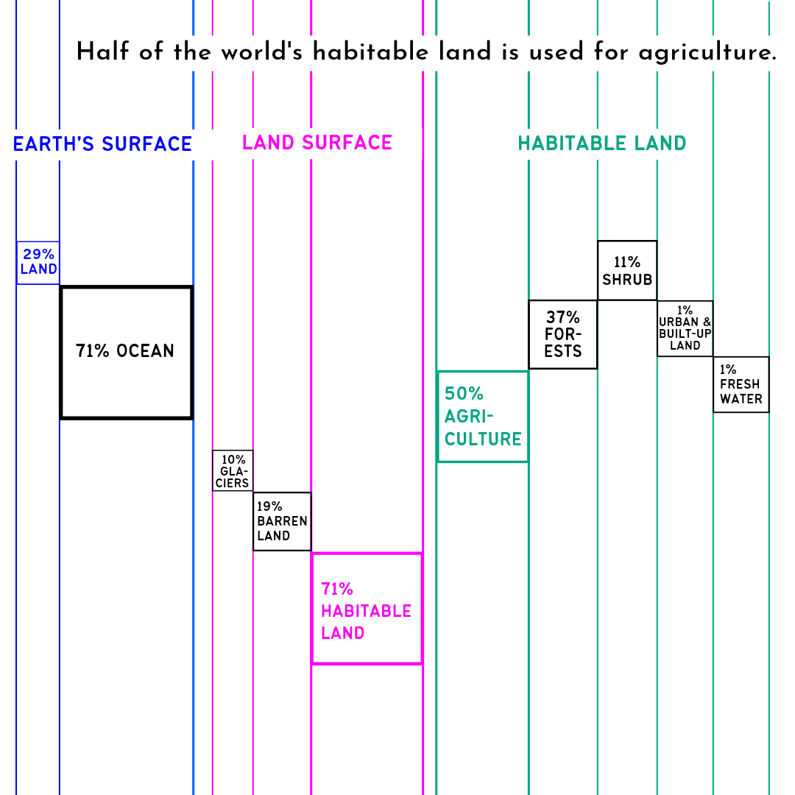

In our bustling world, where cities and human-built infrastructure seem to dominate the landscape, it might come as a surprise to learn that no more than 1% of the world's habitable land is taken up by all of these infrastructures. That includes everything from our big cities and roads to the towns and cozy villages we call home. Conversely, a significant 50% of the world’s habitable land is dedicated to agriculture, playing a pivotal role in transforming our planet's landscape.

Yes, you read that right - we use half of the habitable land solely to feed ourselves. Isn't it just mind-blowing how we ended up using far more land for our consumption than we do to build our homes and communities? This glaring disparity between the land we use for human-built infrastructure and human consumption is both fascinating and alarming, painting a vivid picture of the profound changes our landscape has undergone over the centuries due to human activities.

## It hasn't always been this way.

Looking back at human history, it’s clear that our landscape was once dominated by vast wilderness, lush forests, and sprawling grasslands. However, in recent centuries, this has changed dramatically. Vast swaths of natural ecosystems were cleared to make way for agricultural purposes, leading to dominance in the world's land use. By expanding agricultural land to meet the needs of a growing population, we have fundamentally altered the landscape of our world.

## Declining natural habitat land share over time

<noscript>&lt;You need to enable JavaScript to run this interactive visualization&gt;</noscript>

The transformation of once-wild landscapes into land devoted to keeping pace with growing consumption patterns, has emerged as one of the significant human-induced impacts on the health of our planet. This affects not only the environment but also biodiversity and climate patterns. As we find ourselves grappling with the environmental repercussions of our choices, it leaves us to take a moment to think about the vast amount of land required to sustain our way of life. Whether intentionally or unintentionally, humans compete inevitably for limited space along with numerous wild species as our planet becomes more densely populated.

## The world population has increased rapidly over the decades.

<noscript>&lt;You need to enable JavaScript to run this interactive visualization&gt;</noscript>

The world's population is projected to continue growing, putting even greater pressure on our finite resources. In the delicate dance of our existence on this increasingly crowded planet, we must strive to meet people’s needs while minimizing the impact on nature. How to feed, house, clothe and power 10 billion of us without eliminating very many species and wrecking the planet is perhaps this century’s greatest chal­lenge. Balancing the need for food production with responsible land management and environmental stewardship is paramount.
